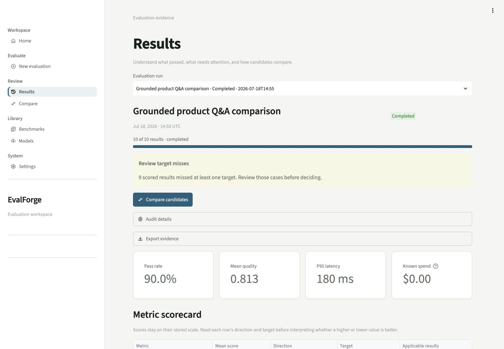

# EvalForge

**Compare prompts and models against the same test set before you ship.**

EvalForge is a local-first evaluation dashboard for teams building with LLMs. It runs a shared set
of test cases across prompt and model candidates, then shows correctness, relevance, groundedness,
hallucination risk, speed, and cost in one reviewable result. The included demo is deterministic,
works offline, and needs no API key.



## Try it locally

You need Python 3.11 or 3.12 and [uv](https://docs.astral.sh/uv/). From a local clone:

```bash
uv sync --frozen
uv run evalforge demo
```

Open `http://127.0.0.1:8501`. EvalForge creates a local database, installs sample data, and starts
the API and dashboard for you. Press `Ctrl+C` when you are done.

For a guided first run, see [Getting started](docs/getting-started.md).

## The core workflow

1. **Choose a test set.** Start with a sample benchmark or import JSON/CSV cases.
2. **Choose candidates.** Compare prompts and model profiles, and select the baseline.
3. **Review the result.** Find regressions, inspect the evidence, and export a review package.

Everything else supports that loop. Provider setup, shared-workspace controls, and operational
details stay out of the way until you need them.

## What EvalForge measures

| Signal | What it helps answer |
| --- | --- |
| Correctness | Does the output match the expected answer? |
| Relevance | Does it address the question or configured keywords? |
| Groundedness | Are claims supported by the supplied context? |
| Hallucination risk | Does the output introduce unsupported facts, numbers, or links? |
| Constraints | Is the format, phrase, JSON, or style requirement satisfied? |
| Operations | What were the latency, token usage, and known estimated cost? |

Built-in quality scores are deterministic, explainable heuristics. They are useful for regression
checks and comparisons, not a replacement for calibrated human review. A metric is marked not
applicable when its required evidence is missing; EvalForge does not invent a score.

## Use your own data and models

- Open **Benchmarks** under **Library** to import a JSON or CSV test set.
- Add a prompt version and a model profile in the dashboard.
- Keep the default offline models while learning the workflow.
- Enable a real provider only after reviewing the data-transfer and spend controls in
  [Operations](docs/operations.md).

Real provider calls are disabled by default. Provider credentials stay in backend settings and are
never entered in the dashboard or stored in a run request.

## Extend the source

EvalForge has typed source-level contracts for model adapters, asynchronous evaluators, and export
sinks. It does **not** yet discover third-party plugins automatically; an extension must be wired
into a source build. See [Extending EvalForge](docs/extending.md) and the tested
[extension examples](examples/extensions/README.md).

## Documentation

- [Getting started](docs/getting-started.md)
- [Troubleshooting](docs/troubleshooting.md)
- [Evaluation methodology](docs/evaluation-methodology.md)
- [Architecture](docs/architecture.md)
- [API contract](docs/api.md)
- [Operations and shared workspaces](docs/operations.md)
- [Security design](docs/security.md)
- [Contributing](CONTRIBUTING.md)
- [Support](SUPPORT.md)

## Project status

EvalForge is beta software. The deterministic local workflow, SQLite and PostgreSQL persistence,
provider contracts, evidence exports, the desktop workflow, and key mobile layouts are covered by
automated tests.
Hosted deployment, a specific identity provider, and paid-provider behavior still require your own
environment-specific validation.

Licensed under the [MIT License](LICENSE). See the [changelog](CHANGELOG.md) for release notes.
