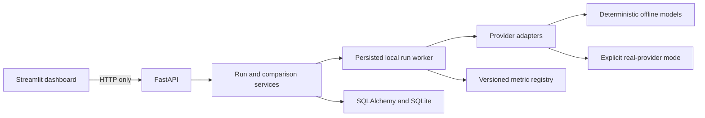

# EvalForge

**Make LLM quality visible before it reaches production.**

EvalForge is a provider-neutral evaluation workbench for comparing prompts and models over a
versioned benchmark. It records immutable run provenance, explains every score, separates quality
from latency and cost, and ships with a deterministic offline demo that needs no API key.

## What you can do

- Build or import reusable JSON/CSV test suites.
- Version system and user prompts with strict, auditable placeholders.
- Run every selected prompt against every selected model profile.
- Score correctness, relevance, phrase coverage, JSON validity, groundedness, hallucination risk,
  and constraint/style adherence.
- Compare paired results by test case, including wins, ties, failures, median/P95 latency, token
  usage, and estimated cost.
- Inspect the exact output, reference, context, metric evidence, prompt/model snapshot, request ID,
  and error classification behind a result.
- Exercise the entire product offline with repeatable demo providers, then explicitly opt into an
  OpenAI or OpenAI-compatible backend.

## Architecture



FastAPI is the system of record. The Streamlit process never opens the database and never receives
provider secrets. SQLite is the default for a single-node portfolio deployment. PostgreSQL is also
supported in the same one-worker topology; horizontal execution still requires a durable queue or
lease protocol.

## Five-minute offline demo

Prerequisites: Python 3.11 or 3.12 and [uv](https://docs.astral.sh/uv/).

```bash
cp .env.example .env
uv sync --all-groups
uv run alembic upgrade head
uv run evalforge seed
```

Start the API in one terminal:

```bash
uv run uvicorn evalforge.api.app:app --host 127.0.0.1 --port 8000 --workers 1
```

Start the dashboard in another terminal:

```bash
uv run streamlit run src/evalforge/dashboard/app.py --server.address 127.0.0.1 --server.port 8501
```

Open `http://127.0.0.1:8501`, choose **Run Evaluation**, and compare the seeded prompt and demo
model profiles. API documentation is available at `http://127.0.0.1:8000/docs` in development.

## Truthful score semantics

EvalForge's built-in quality metrics are deterministic, explainable heuristics. They are useful for
regression gates and fast comparison, not substitutes for calibrated human review.

- Correctness is not applicable without a reference answer.
- Groundedness and hallucination risk are not applicable without source context or factual
  reference evidence.
- Unknown model pricing is reported as unavailable, never as zero cost.
- Demo latency and usage are labeled synthetic.
- A quality summary averages only the explicitly selected, applicable quality metrics and always
  exposes its denominator and weights.

The metric formulas, versions, limitations, and evidence fields are documented in
[`docs/evaluation-methodology.md`](docs/evaluation-methodology.md).

## Real providers are opt-in

Real calls are disabled by default. The backend requires an environment-only key, a server-side
model allowlist, `EVALFORGE_REAL_RUNS_ENABLED=true`, and an explicit run acknowledgment. Preflight
shows the planned case, variant, call, and token limits before submission. The API never accepts a
provider base URL or secret in a run request and never silently switches between Responses and Chat
Completions after a failure. The input guard uses rendered UTF-8 bytes plus a configurable
per-request framing margin; it is deliberately labeled as a safety estimate, not tokenizer output
or invoice data. Runs containing unpriced models require a second explicit acknowledgment.

## Quality gates

```bash
make check
```

The deterministic suite covers metric boundaries, provider contracts, database migrations, run
state transitions, immutable snapshots, API validation, imports, comparisons, and Streamlit
AppTest journeys. A separate credential-free Playwright job starts the real API and dashboard and
runs the seeded workflow from the root entry route. Live-provider tests are marked `live` and
excluded from normal CI.

## Documentation

- [Architecture](docs/architecture.md)
- [API contract](docs/api.md)
- [Evaluation methodology](docs/evaluation-methodology.md)
- [Operations](docs/operations.md)
- [Security](docs/security.md)
- [Contributing](CONTRIBUTING.md)

## Current proof boundary

The repository includes deterministic, fixture-backed native-process and local Compose proof plus
mocked provider contract tests. That evidence does not imply hosted, production, paid-provider,
multi-user, or horizontally scaled validation. The completion record names each proof layer
independently.

## License

MIT
