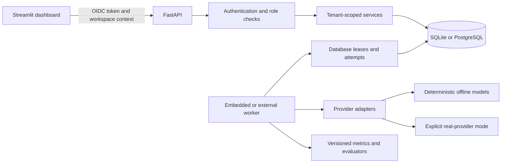

# EvalForge

**Make LLM quality visible before it reaches production.**

EvalForge is a provider-neutral evaluation workbench for comparing prompts and models over a
versioned benchmark. It records immutable run provenance, explains every score, separates quality
from latency and cost, and ships with a deterministic offline demo that needs no API key.

## What you can do

- Build or import reusable JSON/CSV test suites.
- Version system and user prompts with strict, auditable placeholders.
- Run every selected prompt against every selected model profile.
- Score correctness, relevance, phrase coverage, JSON validity, groundedness, hallucination risk,
  and constraint/style adherence.
- Compare paired results by test case, including wins, ties, failures, median/P95 latency, token
  usage, and estimated cost.
- Inspect the exact output, reference, context, metric evidence, prompt/model snapshot, request ID,
  and error classification behind a result.
- Export a versioned, SHA-256-addressed evidence package with a content-redacted default or an
  explicitly confirmed full-evidence profile.
- Use zero-configuration local identity on loopback, or configure OIDC-backed shared workspaces
  with Viewer, Editor, Admin, and Owner roles.
- Exercise the entire product offline with repeatable demo providers, then explicitly opt into an
  OpenAI or OpenAI-compatible backend.

## Architecture



FastAPI is the system of record. The Streamlit process never opens the database or receives
provider secrets. SQLite is the default for one embedded worker on a local filesystem. PostgreSQL
supports database-backed atomic claims, renewable leases, bounded takeover, cancellation, and
separate `api_only` / `database_worker` processes. A database lease prevents duplicate claims; it
cannot make an externally billed request exactly-once, so billing-ambiguous attempts are retained
and are never replayed automatically.

Shared OIDC mode additionally requires Streamlit's server-side OAuth client and access-token
exposure configuration. Follow the secret-mount and identity setup in
[`docs/operations.md`](docs/operations.md); backend OIDC environment values alone are not a complete
dashboard login configuration.

## Five-minute offline demo

Prerequisites: Python 3.11 or 3.12 and [uv](https://docs.astral.sh/uv/).

```bash
cp .env.example .env
uv sync --all-groups
uv run alembic upgrade head
uv run evalforge seed
```

Start the API in one terminal:

```bash
uv run python scripts/start_api.py
```

Start the dashboard in another terminal:

```bash
uv run python scripts/start_dashboard.py
```

The validated script launches the canonical neutral entry point at
`src/evalforge/streamlit_app.py`; use that path for any direct Streamlit tooling as well.

Open `http://127.0.0.1:8501`, choose **New evaluation**, name the run, and compare the seeded prompt
and demo model profiles. The first prompt/model pair is shown as the shared-case comparison
baseline. API documentation is available at `http://127.0.0.1:8000/docs` in development.

## Truthful score semantics

EvalForge's built-in quality metrics are deterministic, explainable heuristics. They are useful for
regression gates and fast comparison, not substitutes for calibrated human review.

- Correctness is not applicable without a reference answer.
- Groundedness and hallucination risk are not applicable without source context or factual
  reference evidence.
- Unknown model pricing is reported as unavailable, never as zero cost.
- Demo latency and usage are labeled synthetic.
- A quality summary averages only the explicitly selected, applicable quality metrics and always
  exposes its denominator and weights.

The metric formulas, versions, limitations, and evidence fields are documented in
[`docs/evaluation-methodology.md`](docs/evaluation-methodology.md).

## Real providers are opt-in

Real calls are disabled by default. The backend requires an environment-only key, a server-side
model allowlist, `EVALFORGE_REAL_RUNS_ENABLED=true`, explicit acknowledgment of external data
transfer and cost, and a user-selected spend ceiling. Preflight must fit both that ceiling and the
server cap before submission. Runs containing unpriced models require a separate unknown-cost
acknowledgment; the ceiling remains a planning control rather than a provider billing limit. The API
never accepts a provider base URL or secret in a run request and never silently switches between
Responses and Chat Completions after a failure. Billable generation makes exactly one network
attempt per planned call, including on HTTP 429; preflight reports zero automatic retries and the
same maximum request count as the logical call count. The input guard uses rendered UTF-8 bytes plus
a configurable per-request framing margin; it is deliberately labeled as a safety estimate, not
tokenizer output or invoice data.

## Quality gates

```bash
make check
```

The deterministic suite covers metric boundaries, provider contracts, identity and cross-tenant
authorization, database migrations and leases, run state transitions, immutable snapshots, API
validation, imports, comparisons, export packages, and Streamlit AppTest journeys. PostgreSQL 17
integration tests exercise migration, lease contention, and lifecycle behavior. A separate
credential-free Playwright job starts the real API and dashboard and runs the seeded workflow plus
the cold-route and mobile matrices. Live-provider tests are marked `live`, excluded from normal CI,
and skip before credential or client access when no explicitly registered judge is available.

## Documentation

- [Architecture](docs/architecture.md)
- [API contract](docs/api.md)
- [Evaluation methodology](docs/evaluation-methodology.md)
- [Operations](docs/operations.md)
- [Security](docs/security.md)
- [Phase 3 hardening record](docs/llm-evaluation-dashboard/2026-07-18-phase-3-hardening.md)
- [Contributing](CONTRIBUTING.md)

## Current proof boundary

The repository includes deterministic native-process proof, local PostgreSQL 17 lease/lifecycle
proof, container image builds, Compose configuration validation, mocked provider contracts, and
desktop/mobile browser journeys. OIDC behavior is locally proven with signed fixtures, but no real
identity-provider login was performed. This evidence does not imply hosted deployment, production
TLS/readback, external CI, or paid-provider calibration. The completion record names each proof
layer independently.

## License

MIT
