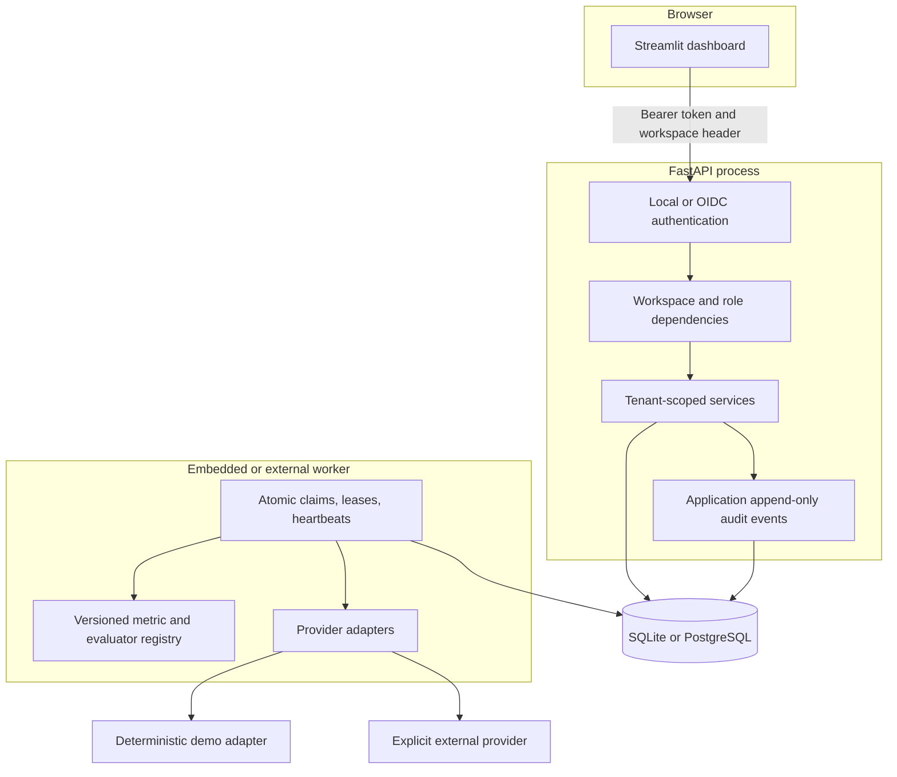
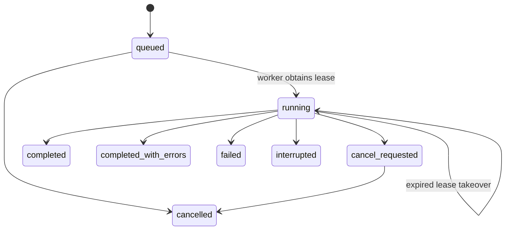

# Architecture

## Design goals

EvalForge is built for explainable evaluation work that can start locally and grow into a shared
workspace without changing the evidence contract:

1. The complete deterministic workflow works without a key or network call.
2. Historical runs remain interpretable after datasets, prompts, metrics, pricing, or model
   configuration change.
3. Every public resource lookup is workspace-scoped and every mutation is role-gated.
4. Missing evidence stays missing instead of becoming a misleading zero.
5. Provider credentials and endpoints remain server-side.
6. SQLite stays a simple embedded topology while PostgreSQL can coordinate separate API and worker
   processes through database leases.

## Component map

FastAPI is the system of record. Streamlit holds transient selection state and bounded read caches;
it does not open the database or receive provider credentials. In OIDC mode the browser session
supplies a short-lived access token to the dashboard client, which sends it in the Authorization
header. Workspace identity is carried separately in `X-EvalForge-Workspace-ID`.

## Identity and authorization

`local` mode creates one deterministic Owner and workspace for a zero-configuration loopback demo.
Configuration rejects local mode when either server is bound beyond loopback. `oidc` mode validates
asymmetric JWTs against an exact HTTPS issuer, audience, expiration, allowed algorithm, and bounded
JWKS resolver. The issuer and subject resolve to a provisioned active user and active membership.

Roles are ordered Viewer, Editor, Admin, and Owner. Viewers read and export evidence; Editors manage
benchmarks, prompts, and runs; Admins also manage model profiles; Owners are reserved for workspace
governance. Dashboard affordances mirror these decisions, but the API and repository scopes remain
the authority. A caller with no selected membership, a suspended identity, a stale membership, or a
resource from another workspace receives a denial without object-existence detail.

Workspace scope is persisted on datasets, prompts, model profiles, runs, candidates, results,
execution attempts, and audit events. Tenant-local uniqueness and repository predicates prevent a
global ID from becoming an authorization bypass. The migration backfills pre-identity data into the
stable local workspace.

## Run lifecycle and durable execution

Submission validates the Cartesian product, placeholders, provider capability, transfer and cost
consent, user spend ceiling, server limits, pricing coverage, and selected metrics in the same
transaction that writes the immutable run snapshot. The database row is the queue authority.

A worker atomically claims eligible work with an owner, random token, monotonic epoch, expiry, and
execution-attempt record. Heartbeats renew ownership. Every worker mutation is fenced by the active
lease token and epoch. A stale worker stops writing immediately. On a heartbeat failure, in-flight
work is cancelled and its attempt is closed, while the ambiguous lease remains until its recorded
expiry so another worker cannot replay it early. A later takeover records the expired attempt.

Uniqueness on candidate/case snapshots makes result persistence idempotent, but no local protocol
can guarantee an external provider call was exactly-once. Returned output, request ID, usage,
latency, known cost, and sanitized error evidence are committed before scoring. Billing-ambiguous
work is retained and is not automatically repeated.

## Persistence model

- `users`, `workspaces`, and `workspace_memberships` establish active identity and ordered roles.
- `datasets` and `test_cases` hold reusable, ordered benchmark evidence.
- `prompt_templates` and `model_profiles` are immutable-version-friendly candidate definitions;
  profiles contain no credentials.
- `evaluation_runs` store idempotency, immutable input snapshots, selected metrics, provider
  disclosures, spend ceilings, progress, and lease state.
- `run_candidates` and `evaluation_results` preserve candidate/case snapshots, output, provider
  metadata, usage, latency, cost, errors, and metric evidence.
- `calibration_reports` link one terminal run, candidate, and metric to an immutable,
  content-minimized threshold report. Uploaded labels and reviewer identifiers are streamed into
  bounded memory and are not stored or multipart-spooled to temporary files.
- `execution_attempts` preserve claim, heartbeat, takeover, outcome, and error-class evidence.
- `audit_events` record actor, workspace, action, resource, request ID, and bounded metadata.

Currency uses integer micro-USD. Timestamps used for claim eligibility come from the database clock,
preventing host/DB clock skew from delaying new work.

## SQLite and PostgreSQL topologies

File-backed SQLite enables foreign keys, WAL, and a bounded busy timeout. It is supported with
`EVALFORGE_EXECUTOR_MODE=embedded_single` and one API/worker process on a local filesystem.

PostgreSQL uses `postgresql+psycopg` and supports `embedded_single`, `api_only`, and
`database_worker` modes. Database-backed leases make multiple workers contend safely for one run,
and API-only readiness truthfully reports that an external worker is unobserved rather than
inventing capacity. This is execution-coordination proof, not a claim of exactly-once external
billing, hosted availability, or production operational readiness.

## Provider and export boundaries

Adapters normalize output, provider/model, API mode, usage, latency, request ID, finish reason,
retry count, cost evidence, and safe errors. Real mode is disabled unless the server enables it.
Endpoints and keys come only from backend settings; model names are allowlisted; API mode is
explicit; and failure never triggers hidden endpoint fallback. Billable generation performs one
network attempt per planned call, including 429 responses, unless a future concrete provider adds a
separately proven and budgeted idempotency contract.

Run exports use the versioned `evalforge.run-export.v1` envelope. Canonical JSON produces a payload
SHA-256 recorded in the response header and local sink receipt. `content_redacted` is the dashboard
default; `full_evidence` requires an explicit disclosure choice and may contain proprietary or
personal content.

Run-linked calibration uses the API as its trust boundary. The server derives formula-safe label
templates in visible case order and rejects client-supplied dataset, metric, case mapping, item, or
score values that do not match immutable run evidence. Reports are append-only, workspace scoped,
and SHA-256-addressed; identical imports return the existing record. There is no report mutation,
reviewer-management, or threshold-promotion path.

## Observability

Every API request receives a request ID. Logs default to event names, request/run/workspace IDs,
status, durations, and sanitized error classes; authorization, prompt, context, reference, output,
and raw provider errors are excluded. Liveness, database/migration readiness, executor role,
worker-observation truth, provider capability, and audit evidence remain separate signals.
