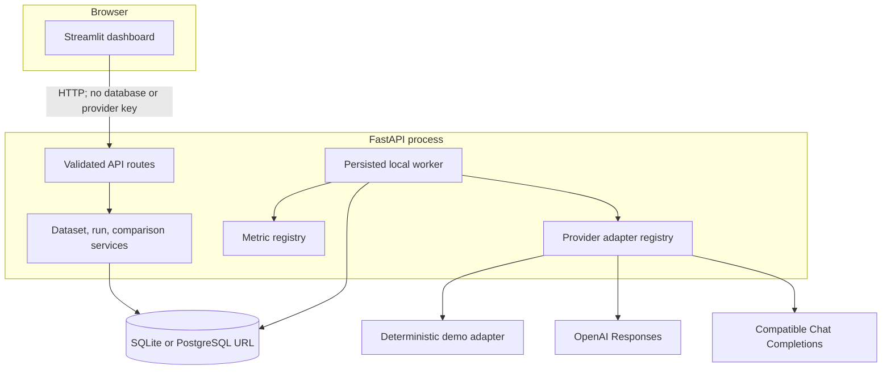
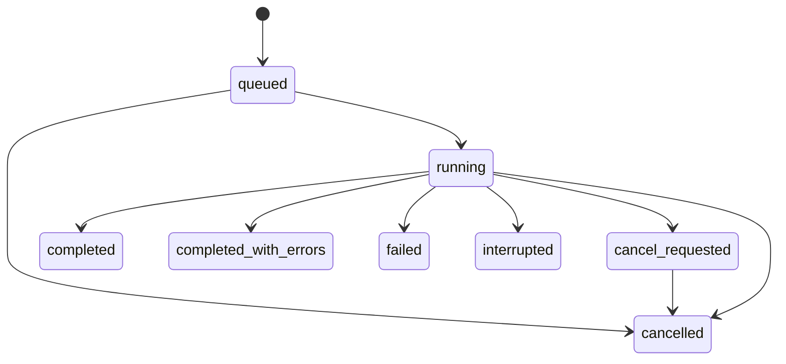

# Architecture

## Design goals

EvalForge is optimized for trustworthy local experimentation:

1. A user can exercise the complete workflow without a key or network call.
2. Historical runs remain interpretable after source datasets, prompts, metrics, pricing, or model
   configuration change.
3. Missing evidence stays missing instead of becoming a misleading zero.
4. Provider credentials and endpoints remain server-side.
5. Quality, risk, latency, and cost remain separate dimensions unless a run explicitly records a
   visible weighting policy.

Multi-tenant authentication, a distributed queue, and horizontally scaled SQLite are deliberately
outside the single-node portfolio boundary.

## Component map

FastAPI is the system of record. Streamlit holds only transient UI selection state and short-lived
read caches. Provider calls, run limits, persistence, metric formulas, and exports are backend
responsibilities.

## Run lifecycle

Run submission validates the whole Cartesian product, limits, placeholders, provider capability,
pricing consent, and explicit real-run acknowledgment while holding the same transaction used to
write the run. It persists that exact preflight evidence plus immutable case and candidate snapshots
before returning `202 Accepted`. The local worker claims queued records,
performs bounded concurrent generation, commits provider evidence, scores the recorded output, and
then commits the metric result. A scoring failure therefore cannot erase a returned provider output,
usage, request ID, or known spend, and one item failure cannot erase unrelated successful evidence.

Terminal states do not return to `running`. Startup recovery marks work that was running during a
process stop as `interrupted`. Real-provider requests are not silently repeated because an ambiguous
timeout or restart could create a second billed request.

## Persistence model

- `datasets` describe reusable benchmark collections.
- `test_cases` contain input, evaluator-only reference answer, ordered context chunks, keywords,
  constraints, tags, and ordering. Candidate prompt templates cannot reference the answer.
- `prompt_templates` contain versioned system/user templates and hashes.
- `model_profiles` contain provider, model, explicit API mode, parameters, price metadata, and demo
  classification; they never contain credentials.
- `evaluation_runs` contain status, idempotency/request hashes, a complete dataset snapshot, the
  accepted preflight snapshot and consent flags, selected metric configuration, progress,
  application version, and timestamps.
- `run_candidates` snapshot each prompt-model combination.
- `evaluation_results` store output, provider metadata, usage, latency, micro-USD cost, retry/error
  truth, case/prompt/model snapshots, and case-level status. Their metric JSON stores value,
  direction, unit, applicability, threshold, explanation, formula version, and evidence.

Uniqueness on a candidate/case snapshot prevents duplicate persisted results. Currency uses integer
micro-USD to avoid floating point drift.

## SQLite contract and scale path

File-backed SQLite enables foreign keys, WAL, and a bounded busy timeout. Transactions stay short,
and the local deployment runs one API/worker process because SQLite still has one writer. WAL files
must stay on a local filesystem.

`EVALFORGE_DATABASE_URL` accepts SQLite or `postgresql+psycopg`; the PostgreSQL driver is an optional
install extra. The packaged migration and readiness path are exercised against PostgreSQL in CI. A
multi-process deployment must still move job claiming to a durable queue or database lease and
validate its locking behavior before adding workers. Changing only the URL is not sufficient proof
of distributed execution.

## Provider boundary

Adapters normalize text, provider/model, API mode, usage, latency, request ID, finish reason, retry
count, cost evidence, and safe error type. The deterministic adapter derives behavior from SHA-256
over the immutable request and seed, not Python's process-randomized hash.

Real provider mode is disabled unless the server enables it. Provider endpoints and keys are loaded
from backend settings, model names must be allowlisted, and each profile chooses either `responses`
or `chat_completions`. Failure in one mode never triggers a hidden fallback to the other.

## Observability

Every request receives a request ID. Logs default to event names, request/run identifiers, status,
durations, and sanitized error classes; prompt, context, output, authorization, and provider error
bodies are excluded by default. Health separates process liveness from database readiness and
provider capability.
