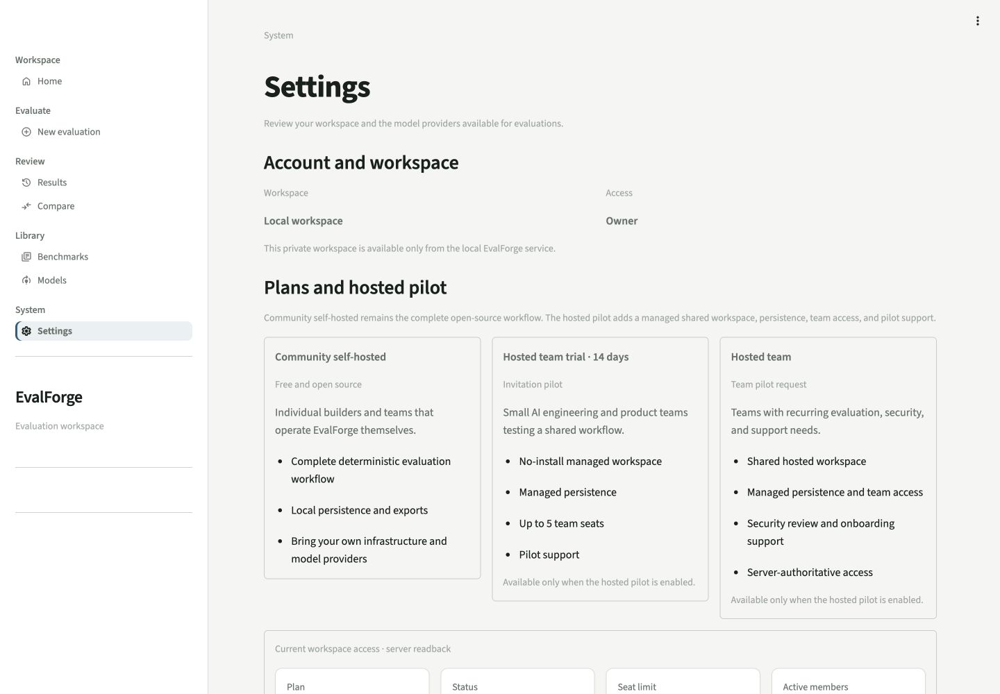
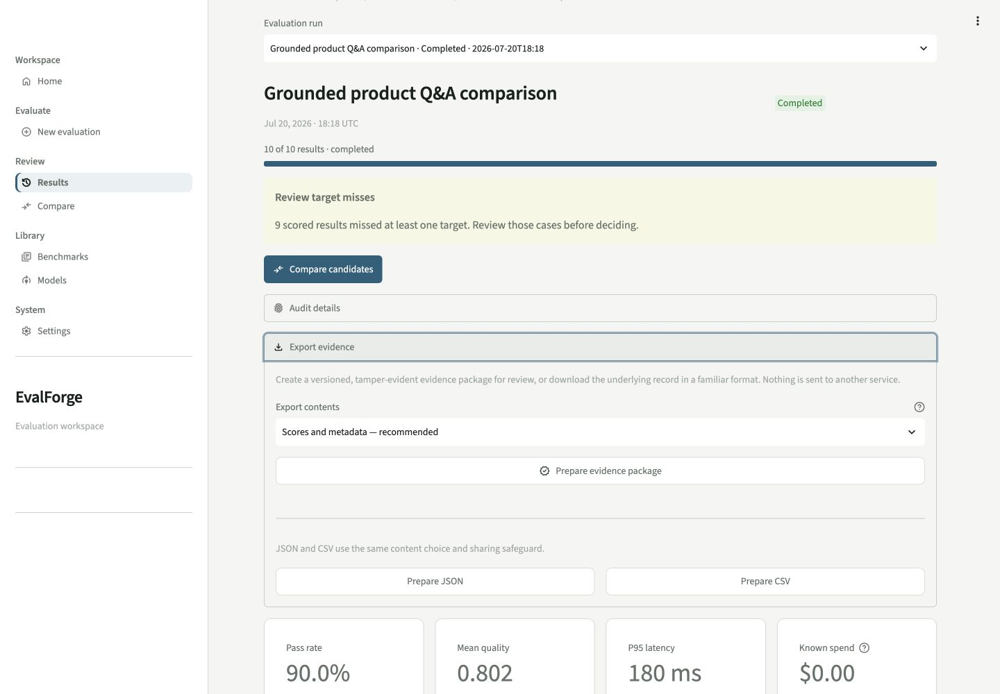
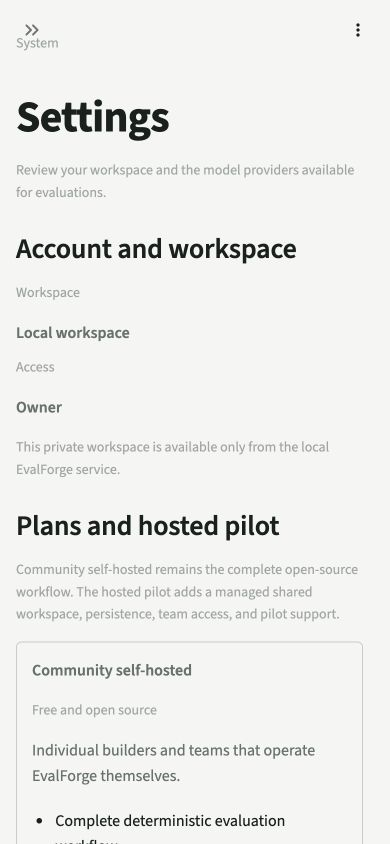

# EvalForge local OSS captioned demo proof

Date: 2026-07-20
Proof class: **Local browser + local API readback**
Environment: deterministic OSS demo on loopback (`127.0.0.1`)

This is the first launch demo artifact for the commercialization pilot. It proves the useful
self-hosted path: one user can compare two model candidates on the same five-case test set, inspect
the resulting evidence, and download JSON. It does **not** prove a hosted deployment, OIDC,
cross-workspace isolation in a live environment, managed PostgreSQL, payment, a team commitment, or
external-user activation.

## 55-second captioned sequence

| Time | Recorded frame | Caption |
|---|---|---|
| 0–5s | Local Settings and workspace identity | “Changing a prompt or model is easy. Proving the change is safer to ship is harder.” |
| 5–12s | OSS and hosted-team plan boundary | “EvalForge stays useful as free, self-hosted software; managed team workspaces are an optional pilot.” |
| 12–22s | New evaluation with one prompt and two model profiles | “Run two candidates against the same five test cases without a provider key.” |
| 22–36s | Completed run with 10 of 10 persisted results | “Inspect pass rate, quality, latency, cost context, and case-level evidence from one comparison.” |
| 36–48s | Export evidence panel | “Prepare and download a reviewable JSON evidence record.” |
| 48–55s | Mobile Settings at 390×844 | “The same OSS and hosted-team boundary remains readable on mobile.” |

### Frames 1–2 — local workspace and OSS versus hosted-team boundary

Caption: The local owner workspace preserves the complete free self-hosted workflow. Hosted trial and
team cards describe the optional managed value, but their actions correctly remain unavailable in
local mode.

### Frames 3–5 — completed comparison and export

Caption: `Grounded product Q&A comparison` completed all 10 planned results from one prompt across two
model profiles and five shared cases. The browser prepared JSON and observed the download event.

### Frame 6 — mobile plan boundary

Caption: At 390×844, the workspace identity, OSS plan, and hosted-pilot explanation remain readable
without horizontal overflow in the captured viewport.

## Recorded evidence

| Check | Result |
|---|---|
| Comparison matrix | 1 prompt × 2 model profiles × 5 shared cases |
| Terminal result | Completed; 10 of 10 results persisted |
| Visible evidence | 90.0% pass rate, 0.802 mean quality, 180 ms synthetic p95, $0.00 known spend |
| Result engagement | JSON preparation succeeded and a browser download event was observed |
| Funnel readback | `core_job_start=1`, `evaluation_complete=1`, `result_engagement=1`, `activated_runs=1` |
| Local elapsed evidence | 47.863 seconds from the first recorded run event to result engagement |
| Browser console | 0 warnings and 0 errors |
| Responsive proof | Desktop 1440×1000 and mobile 390×844 screenshots reviewed |

The elapsed value is local run-to-export evidence, not hosted signup-to-activation time. Local mode
does not emit `signup`, so activation-duration percentiles correctly remained unavailable. Latency,
quality, and cost shown in the deterministic demo are product evidence, not customer outcomes or
live-provider measurements.

## Before/after proof boundary

No buyer baseline was observed, so the “before” side remains unknown. The demonstrated “after” is a
single local application that keeps the comparison matrix consistent, persists the evidence, and
downloads a reviewable artifact. A customer time-saving claim requires a real buyer's prior workflow
and an external hosted run; this local demo does not supply either one.
